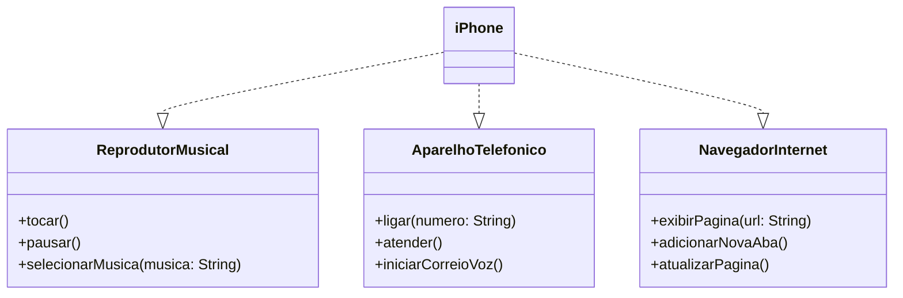
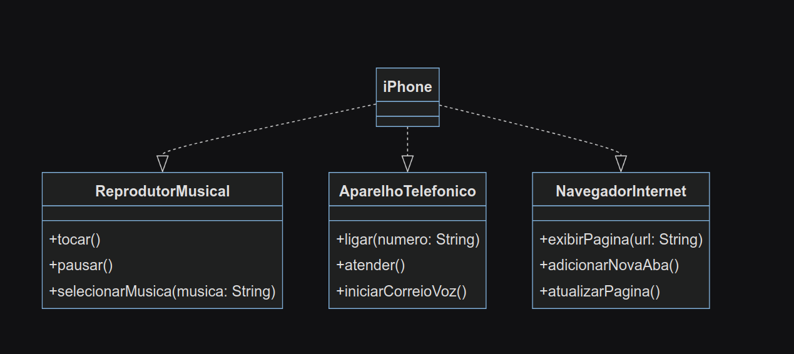

# DIO - Trilha Java Básico

---

## POO - Desafio

"Modelagem e Diagramação de um Componente iPhone

Neste desafio, você será responsável por modelar e diagramar a representação UML do componente iPhone, abrangendo suas funcionalidades como Reprodutor Musical, Aparelho Telefônico e Navegador na Internet."

Para ver mais acesse o link do [repositório](https://github.com/digitalinnovationone/trilha-java-basico/tree/main/desafios/poo#poo---desafio) no GitHub.

### Diagrama UML

### Diagrama UML

